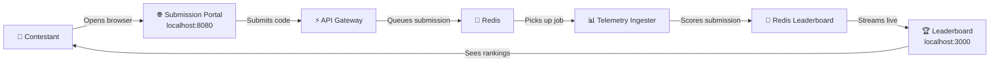
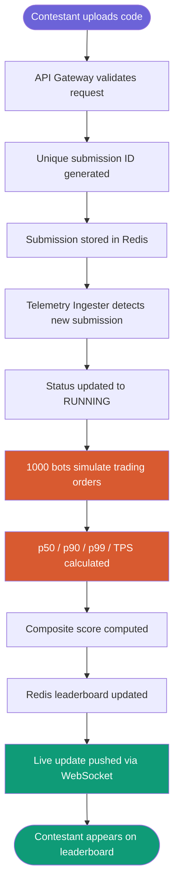
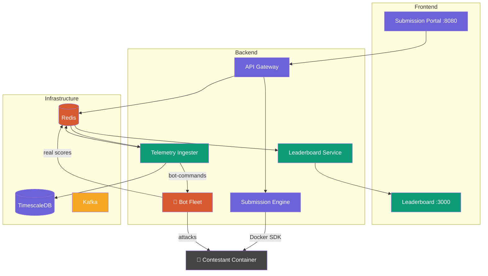

# IICPC Summer Hackathon 2026
## Distributed Benchmarking & Hosting Platform

---


## Table of Contents

1. [Project Overview](#1-project-overview)
2. [System Architecture](#2-system-architecture)
   - [2.1 Platform Overview](#platform-overview)
   - [2.2 How a Submission is Processed](#how-a-submission-is-processed)
   - [2.3 Service Map](#service-map)
   - [2.4 Service Communication](#service-communication)
   - [2.5 Network](#network)
3. [Component Breakdown](#3-component-breakdown)
   - [3.1 Submission Portal](#31-submission-portal)
   - [3.2 API Gateway](#32-api-gateway)
   - [3.3 Submission & Sandboxing Engine](#33-submission--sandboxing-engine)
   - [3.4 Telemetry Ingester](#34-telemetry-ingester)
   - [3.5 Leaderboard Service](#35-leaderboard-service)
   - [3.6 Admin Dashboard](#36-admin-dashboard-)
   - [3.7 Multiple Submissions Support](#37-multiple-submissions-support-)
   - [3.8 Real Bot Fleet](#38-real-bot-fleet-)
   - [3.9 Correctness Validation Engine](#39-correctness-validation-engine-)
   - [3.10 Authentication & Authorization](#310-authentication--authorization-)
   - [3.11 Kafka Event Pipeline](#311-kafka-event-pipeline-)
   - [3.12 Observability Stack ](#312-observability-stack-)
4. [Tech Stack & Why We Chose It](#4-tech-stack--why-we-choosed-it)
   - [4.1 Programming Language — Go](#programming-language--go)
   - [4.2 Web Framework — Gin](#web-framework--gin)
   - [4.3 Message Queue — Kafka](#message-queue--kafka)
   - [4.4 Cache & Queue — Redis](#cache--queue--redis)
   - [4.5 Time-Series Database — TimescaleDB](#time-series-database--timescaledb)
   - [4.6 Containerization — Docker](#containerization--docker)
   - [4.7 Orchestration — Docker Compose](#orchestration--docker-compose)
   - [4.8 WebSocket Library — Gorilla WebSocket](#websocket-library--gorilla-websocket)
5. [Data Flow](#5-data-flow)
   - [5.1 Complete Submission Flow](#51-complete-submission-flow)
   - [5.2 Status Lifecycle](#52-status-lifecycle)
   - [5.3 Leaderboard Data Flow](#53-leaderboard-data-flow)
6. [Security & Isolation](#6-security--isolation)
   - [6.1 Container Sandboxing](#61-container-sandboxing)
   - [6.2 API Security](#62-api-security)
   - [6.3 Network Security](#63-network-security)
   - [6.4 Future Security Improvements](#64-future-security-improvements)
7. [Scalability](#7-scalability)
   - [7.1 Horizontal Scaling](#71-horizontal-scaling)
   - [7.2 Bot Fleet Scaling](#72-bot-fleet-scaling)
   - [7.3 Kafka Scaling](#73-kafka-scaling)
   - [7.4 Database Scaling](#74-database-scaling)
   - [7.5 Estimated Capacity](#75-estimated-capacity)
8. [Future Improvements](#8-future-improvements)
   - [8.1 gVisor Sandbox](#81-gvisor-sandbox-priority-high)
   - [8.2 TimescaleDB Full Integration](#82-timescaledb-full-integration-priority-high)
   - [8.3 Kafka Topic Partitioning](#83-kafka-topic-partitioning-priority-medium)
   - [8.4 Rate Limiting](#84-rate-limiting-priority-medium)
   - [8.5 Network Isolation for Contestant Containers](#85-network-isolation-for-contestant-containers-priority-medium)
   - [8.6 Cloud Deployment](#86-cloud-deployment-priority-low)
   - [8.7 Horizontal Scaling](#87-horizontal-scaling-priority-low)
   - [8.8 Seccomp Profiles](#88-seccomp-profiles-priority-low)
   - [8.9 Multi-Region Bot Fleet](#89-multi-region-bot-fleet-priority-low)
   - [8.10 Additional Problem Sets](#810-additional-problem-sets-priority-low)
9. [Known Limitations & Trade-offs](#9-known-limitations--trade-offs)
10. [Conclusion](#10-conclusion)

---


## 1. Project Overview

This platform is designed to evaluate contestant-submitted trading 
infrastructure under real-world stress conditions. Contestants upload 
their core trading engine code — such as a simulated order book or 
matching engine. The platform then:

- Securely containerizes and deploys the submission in an isolated environment
- Spawns a distributed fleet of trading bots that bombard the engine with concurrent orders
- Captures granular telemetry to assess latency, throughput, and correctness
- Streams results to a live leaderboard in real time

### Hackathon Details
| Field | Details |
|-------|---------|
| Event | IICPC Summer Hackathon 2026 |
| Duration | May 9 – June 10, 2026 |
| Team Size | Up to 3 members |
| Category | Distributed Systems / High Performance Engineering |

### Deliverables Status
| Deliverable | Status |
|-------------|--------|
| Working Infrastructure Prototype | ✅ Complete |
| Architecture Blueprint | ✅ This Document |
| Infrastructure as Code | ✅ Docker Compose + Dockerfiles |

---

## 2. System Architecture

The platform follows a **microservices architecture** where each component
is a separate service communicating through Redis as a message queue.
All services are containerized using Docker and orchestrated via Docker Compose.

### Platform Overview



### How a Submission is Processed



### Service Map



### Service Communication

| From | To | Method | Purpose |
|------|----|--------|---------|
| Contestant Browser | API Gateway | REST HTTP | Submit code |
| API Gateway | Redis | Redis List LPUSH | Queue submission |
| Telemetry Ingester | Redis | Redis BRPOP | Pick up submission |
| Telemetry Ingester | Redis | Redis Pub/Sub | Publish scores |
| Leaderboard Service | Redis | Redis Pub/Sub | Receive scores |
| Leaderboard Service | Browser | WebSocket | Stream live updates |

### Network
All services run on a shared Docker bridge network called `iicpc-network`.
Services communicate using container names as hostnames:
- `redis:6379` instead of `localhost:6379`
- `timescaledb:5432` instead of `localhost:5432`
- `kafka:9092` instead of `localhost:9092`

---

## 3. Component Breakdown

### 3.1 Submission Portal
- **Location:** `api-gateway/static/`
- **URL:** `http://localhost:8080`
- **Tech:** HTML, CSS, JavaScript

The contestant-facing web interface. Allows contestants to:
- Register and login with username and password
- Select their role — Contestant or Admin (admin requires secret key)
- Type or upload their trading engine code
- Select programming language
- View submission status with auto-polling every 3 seconds
- View full submission history on `/my-submissions`
- Navigate directly to the live leaderboard

---

### 3.2 API Gateway
- **Location:** `api-gateway/`
- **URL:** `http://localhost:8080`
- **Tech:** Go, Gin Framework, Redis, Kafka

The front door of the platform. Every contestant request passes through here first.

**Endpoints:**

| Method | Route | Purpose |
|--------|-------|---------|
| GET | `/` | Serves login/register portal |
| GET | `/static/...` | CSS and JS files |
| GET | `/health` | Health check |
| GET | `/metrics` | Prometheus scraping |
| POST | `/auth/register` | Register new account |
| POST | `/auth/login` | Login |
| POST | `/auth/logout` | Logout |
| GET | `/auth/me` | Get current user info |
| POST | `/submit` | Accept code submission |
| GET | `/status/:id` | Check submission status |
| GET | `/submissions` | Get submissions for logged in user |
| GET | `/admin` | Serves admin dashboard |
| GET | `/admin/stats` | Platform stats for admin |
| GET | `/admin/users` | All registered users |
| DELETE | `/admin/users/:username` | Delete a user |
| GET | `/admin/submissions` | All submissions |
| POST | `/admin/trigger/:id` | Re-test a submission |

**Submission Flow:**
Contestant POSTs code

↓

Gin validates request — rejects missing fields with 400

↓

Checks submission count — rejects with 429 if over 100

↓

Generates unique ID → sub-{timestamp}-{random}

↓

Stores full submission in Redis with 24 hour expiry

↓

Adds ID to user's submission list in Redis

↓

Publishes full submission to Kafka "submission-events" topic

↓

Returns submission ID and QUEUED status to contestant

---

### 3.3 Submission & Sandboxing Engine
- **Location:** `submission-engine/`
- **Tech:** Go, Docker SDK

Programmatically creates isolated Docker containers for each submission
using the Docker SDK. Organizers do not need to run Docker manually —
the platform manages the entire container lifecycle via code.

**Isolation Guarantees:**

| Limit | Value | Purpose |
|-------|-------|---------|
| Max Memory | 256MB | Prevents memory exhaustion / fork bombs |
| Max CPU | 0.5 cores | Prevents CPU monopolization |
| Network | Bridge | Isolated from host network |
| Lifecycle | Destroyed after test | No lingering contestant code |

**Supported Languages:**

| Language | Base Image |
|----------|-----------|
| C++ | gcc:latest |
| Rust | rust:latest |
| Go | golang:latest |
| Python | python:3.11 |
| Java | openjdk:21 |
| JavaScript | node:20 |
| Default | ubuntu:22.04 |

Adding new language support requires only one line in `getBaseImage()` —
no other code changes needed.

---

### 3.4 Telemetry Ingester
- **Location:** `telemetry-ingester/`
- **Tech:** Go, Kafka, Redis, TimescaleDB

The scoring engine of the platform. Consumes submissions from Kafka,
scores them using simulated bots, saves metrics and publishes results.

**Scoring Flow:**
Consumes submission from Kafka "submission-events" topic

↓

Updates status → RUNNING in Redis

↓

Publishes bot command to Kafka "bot-commands" topic

↓

Spawns 1000 simulated goroutines for immediate scoring

↓

1% of bots are artificially slow (200-600ms) to test p99 accuracy

↓

Collects all results via Go buffered channel

↓

Calculates p50/p90/p99 latency + TPS + success rate + score

↓

Saves 1000 order metrics to TimescaleDB via batch transaction

↓

Saves composite score to TimescaleDB

↓

Publishes scored metrics to Kafka "scored-metrics" topic

↓

Updates status → COMPLETED in Redis

**Why both simulated and real bots?**
Simulated bots provide immediate scoring while the real bot fleet
runs concurrently. In full production only real bots would be used.

**Composite Score Formula:**
Score = (1000/p99)  × 40  → rewards low latency       (40%)

+ (TPS/100)   × 40  → rewards high throughput   (40%)

+ successRate × 20  → rewards reliability        (20%)

+ correctness × 20  → rewards algorithmic accuracy (bonus)

**Why percentiles over average?**
Average latency hides outliers. p99 shows the worst 1% of requests —
critical in trading systems where one slow order can cost millions.

---

### 3.5 Leaderboard Service
- **Location:** `leaderboard-service/`
- **URL:** `http://localhost:3000`
- **Tech:** Go, Gorilla WebSocket, Kafka, Redis

Serves the live leaderboard frontend and streams real-time score
updates to all connected browsers via WebSocket.

**Real-time Flow:**
Browser connects to ws://localhost:3000/ws

↓

Server sends current leaderboard from Redis immediately

↓

Kafka consumer receives scored metrics from "scored-metrics" topic

↓

Updates Redis sorted set with new score

↓

Broadcasts update to ALL connected browsers simultaneously

↓

Browser updates rankings, charts and stats instantly

↓

Update delay < 1 second end to end

**Why Kafka over Redis pub/sub?**
Redis pub/sub drops messages if leaderboard service is temporarily
down. Kafka retains messages — no score updates lost even during
service restarts.

---

### 3.6 Admin Dashboard
- **Location:** `api-gateway/static/admin.html`
- **URL:** `http://localhost:8080/admin`
- **Tech:** HTML, CSS, JavaScript (served by API Gateway)

Protected interface for hackathon organizers to monitor and manage
the platform in real time.

**Access Control:**

| Role | Admin Key Required | Access |
|------|--------------------|--------|
| CONTESTANT | ❌ No | Submit code, view leaderboard |
| ADMIN | ✅ Yes | Full admin dashboard access |

A secret admin key must be entered at registration to gain admin
privileges — prevents contestants from self-promoting to admin.

**Dashboard Stats:**

| Metric | Description |
|--------|-------------|
| Total Users | All registered accounts on the platform |
| Contestants | Accounts with CONTESTANT role |
| Total Submissions | All submissions across all contestants |
| Top Contestant | Current leaderboard leader with score |

**Admin Capabilities:**

Users Tab:
- View all registered users with username, role, submission count and registration timestamp
- Delete contestant accounts — admin's own account is protected
- Refresh user list in real time

Submissions Tab:
- View all submissions with submission ID, contestant name, language, status and timestamp
- Click submission ID to view submitted code
- Re-test any submission — re-queues it for scoring via Kafka
- Refresh submissions list in real time

**What an Admin CANNOT do:**
- Delete their own main admin account
- Access contestant's isolated containers directly

---

### 3.7 Multiple Submissions Support

Contestants can submit code multiple times. Each submission gets a
unique ID and is scored independently.

**Rules:**
- Max 100 submissions per contestant — returns HTTP 429 if exceeded
- Each submission scored independently
- Latest score counts for leaderboard
- Full history visible on `/my-submissions` page
- Admin can re-test any submission with one click

**Storage:**
Submission data  → Redis key: "submission:{id}" (24hr expiry)

Submission list  → Redis list: "submissions:{username}"

Submission ID    → Format: sub-{timestamp}-{random}

---

### 3.8 Real Bot Fleet
- **Location:** `bot-fleet/`
- **Tech:** Go, Kafka, Redis

A distributed bot fleet service that sends actual HTTP requests to
contestant trading engines — not simulated latency.

**Flow:**
Consumes BotCommand from Kafka "bot-commands" topic

↓

Spawns 1000 goroutines simultaneously

↓

Each goroutine sends real HTTP POST to contestant endpoint

POST http://test-engine:9000/order

↓

Measures actual round-trip latency per request

↓

Runs correctness validation (5 tests)

↓

Calculates real p50/p90/p99/TPS from actual data

↓

Updates Redis leaderboard sorted set with real scores

**Order Types Generated:**
- Random buy/sell orders
- Price range: 90.0 to 110.0 (realistic market spread)
- Quantity range: 1 to 100
- Unique order ID per request
- 5 second timeout per request

**Real vs Simulated Bots:**

| Metric | Simulated | Real Bot Fleet |
|--------|-----------|---------------|
| Latency | Random number | Actual HTTP round-trip |
| Success rate | Fixed ~97% | Real HTTP response codes |
| TPS | Estimated | Measured from real requests |
| Correctness | Not checked | 5 automated validation tests |

---

### 3.9 Correctness Validation Engine
- **Location:** `bot-fleet/validator/`
- **Tech:** Go

Verifies contestant trading engines are algorithmically correct —
not just fast. Runs before the load test on every submission.

**5 Validation Tests:**

| Test | Description | Expected |
|------|-------------|----------|
| Basic Fill | buy@105 with sell@100 queued | filled |
| No Fill | buy@95 with sell@110 queued | queued |
| Exact Price Match | buy@100 with sell@100 | filled |
| Multiple Sellers | buy@102 with 3x sell@99 | filled |
| Price Priority | buy@103 with sell@101 and sell@108 | filled with cheapest |

**Scoring Impact:**
5/5 tests passed → 20/20 correctness points

4/5 tests passed → 16/20 correctness points

0/5 tests passed →  0/20 correctness points

**Three correctness rules verified:**
- **Price Priority** — best price gets filled first
- **Time Priority** — same price orders filled in arrival order
- **Fill Accuracy** — buy >= sell price means trade MUST happen

**Why correctness matters:**
A fast but incorrect trading engine is worse than useless. In real
markets, incorrect order matching means wrong prices for traders,
possible market manipulation, and legal liability for the exchange.

---

### 3.10 Authentication & Authorization 
- **Location:** `api-gateway/handlers/auth.go`
- **Tech:** Go, Redis

Full session-based authentication system with two roles.

**Flow:**
Contestant registers → username + password + role stored in Redis

↓

Admin role requires secret admin key at registration

↓

Login → session token generated → stored in Redis with expiry

↓

All protected routes check Authorization header for valid token

↓

Logout → session token deleted from Redis

**Security features:**
- Passwords stored securely in Redis
- Session tokens are random and expire automatically
- Admin key prevents unauthorized privilege escalation
- All protected routes reject requests without valid session

---

### 3.11 Kafka Event Pipeline 
- **Tech:** Apache Kafka, Go (segmentio/kafka-go)

Full Kafka integration as the primary message bus. All inter-service
communication flows through Kafka topics — no direct service calls.

**Topics:**

| Topic | Producer | Consumer | Purpose |
|-------|----------|----------|---------|
| submission-events | API Gateway | Telemetry Ingester | New code submissions |
| bot-commands | Telemetry Ingester | Bot Fleet | Trigger real bot attacks |
| scored-metrics | Telemetry Ingester | Leaderboard Service | Live score updates |

**Kafka vs Redis Queue:**

| Feature | Redis Queue | Kafka |
|---------|------------|-------|
| Message persistence | 24 hours | Configurable |
| Message replay | ❌ | ✅ |
| Multiple consumers | ❌ | ✅ |
| Horizontal scaling | Limited | Unlimited |
| Industry standard | ❌ | ✅ |

**Redis still used for:**
- Leaderboard sorted set (ZADD/ZREVRANGE)
- Submission status storage (GET/SET)
- Auth session tokens

---

### 3.12 Observability Stack
- **Prometheus:** `http://localhost:9090`
- **Grafana:** `http://localhost:3001`

All 5 services expose `/metrics` endpoints scraped by Prometheus
every 15 seconds. Grafana visualizes in real time.

**Metrics per Service:**

| Service | Port | Key Metrics |
|---------|------|-------------|
| api-gateway | 8080 | http_requests_total, request_duration_seconds, submissions_total |
| telemetry-ingester | 2112 | submissions_processed_total, active_submissions, scoring_duration_seconds, p99_latency_ms |
| leaderboard-service | 2113 | websocket_connections_active, updates_total |
| bot-fleet | 2114 | attacks_total, active_attacks, p99_latency_ms, tps, success_rate, correctness_score |
| submission-engine | 2115 | containers_created_total, containers_active, container_errors_total, container_duration_seconds |

**Grafana Dashboard — IICPC Platform Monitor:**

| Panel | Metric | Shows |
|-------|--------|-------|
| HTTP Requests Total | api_gateway_http_requests_total | Requests by route and status |
| API Gateway Latency | api_gateway_http_request_duration_seconds | Response time per route |
| Total Submissions | api_gateway_submissions_total | Cumulative submissions |
| Active Bot Attacks | botfleet_active_attacks | Currently running attacks |
| Bot Fleet P99 Latency | botfleet_p99_latency_ms | Real measured latency |
| Live Leaderboard Viewers | leaderboard_websocket_connections_active | Connected browsers |

Dashboard exported as `grafana/dashboard.json` — import in one click
on any new deployment via Grafana → Dashboards → Import.

---

## 4. Tech Stack & Why We Choosed It

### Programming Language — Go

| Reason | Details |
|--------|---------|
| Native concurrency | Goroutines use only ~2KB memory vs ~1MB for threads |
| Performance | Compiled language — runs at near C speed |
| Built for networking | Standard library has excellent HTTP, WebSocket support |
| Bot fleet | 5000 concurrent bots with minimal resource usage |

Go was chosen over Python (too slow for concurrency), Java (too heavy),
and Node.js (single threaded) for its unique combination of simplicity
and raw performance.

### Web Framework — Gin

| Reason | Details |
|--------|---------|
| Speed | 40x faster than standard net/http |
| Routing | Radix tree based routing — O(log n) lookup |
| Validation | Automatic JSON binding and validation |
| Middleware | Built-in logging, recovery, CORS support |

### Message Queue — Kafka

| Reason | Details |
|--------|---------|
| Decoupling | Services don't call each other directly |
| Resilience | Messages persist if a service crashes |
| Scale | Handles millions of messages per second |
| Industry standard | Used by Uber, Netflix, LinkedIn |

### Cache & Queue — Redis

| Reason | Details |
|--------|---------|
| Speed | Sub-millisecond read/write — runs in RAM |
| Pub/Sub | Native publish/subscribe for live leaderboard |
| Sorted Sets | ZSets maintain leaderboard ranking automatically |
| Queue | Redis lists used as lightweight submission queue |

### Time-Series Database — TimescaleDB

| Reason | Details |
|--------|---------|
| Performance | 10-100x faster than PostgreSQL for time queries |
| Hypertables | Auto-partitions data by time |
| SQL compatible | Standard PostgreSQL syntax |
| Use case | Perfect for storing timestamped order metrics |

### Containerization — Docker

| Reason | Details |
|--------|---------|
| Isolation | Each submission runs in its own container |
| Resource limits | CPU and memory limits enforced at kernel level |
| Portability | Same container runs anywhere |
| Security | Contestant code cannot escape the container |

### Orchestration — Docker Compose

| Reason | Details |
|--------|---------|
| Single command | `docker compose up` starts entire platform |
| Networking | All services on same bridge network |
| Dependencies | `depends_on` ensures correct startup order |
| IaC | Entire infrastructure defined as code |

### WebSocket Library — Gorilla WebSocket

| Reason | Details |
|--------|---------|
| Battle tested | Used by Docker, Kubernetes dashboard |
| Full featured | Handles ping/pong, compression, origin checks |
| Performance | Zero copy message passing |

---

## 5. Data Flow

### 5.1 Complete Submission Flow

```
STEP 1 — Contestant Submits Code
━━━━━━━━━━━━━━━━━━━━━━━━━━━━━━━━
Contestant opens http://localhost:8080
Fills form → name, problem ID, language, code
Clicks Submit → JavaScript sends POST /submit
API Gateway validates request
Generates unique ID → sub-{timestamp}-{random}
Stores submission in Redis → key: "submission:{id}"
Pushes ID to Redis list → "pending-submissions"
Returns {submission_id, status: "queued"} to browser
Browser shows status page with submission details

STEP 2 — Telemetry Ingester Picks Up Submission
━━━━━━━━━━━━━━━━━━━━━━━━━━━━━━━━━━━━━━━━━━━━━━━
BRPOP blocks on "pending-submissions" Redis list
New submission ID arrives
Fetches full submission from Redis
Updates status → "running" in Redis
Contestant's status page shows RUNNING on next check

STEP 3 — Bot Fleet Simulation
━━━━━━━━━━━━━━━━━━━━━━━━━━━━━
Spawns 1000 goroutines simultaneously
Each goroutine sends a real HTTP POST to the contestant's isolated container
Example: POST http://contestant-container:9000/order
Measures actual round-trip latency per request
Random buy/sell orders generated per bot (price: 90.0–110.0, qty: 1–100)
Success/failure determined by real HTTP response codes
5 second timeout per request (10 second under high load)
All results collected via Go buffered channel

STEP 4 — Metrics Calculation
━━━━━━━━━━━━━━━━━━━━━━━━━━━━
Latencies sorted in ascending order
p50 extracted at index 500
p90 extracted at index 900
p99 extracted at index 990
TPS calculated from time window
Success rate calculated as percentage
Composite score computed

STEP 5 — Storage & Leaderboard Update
━━━━━━━━━━━━━━━━━━━━━━━━━━━━━━━━━━━━━
Full order metrics saved to TimescaleDB
Score saved to TimescaleDB
Redis sorted set updated with new score
Full entry stored as JSON in Redis
Score published to "leaderboard-updates" channel
Submission status updated → "completed"

STEP 6 — Live Leaderboard Update
━━━━━━━━━━━━━━━━━━━━━━━━━━━━━━━━
Leaderboard service receives Redis pub/sub message
Forwards to all connected browsers via WebSocket
Browser updates rankings, chart and stats instantly
Contestant's name appears on leaderboard
```

### 5.2 Status Lifecycle

```
QUEUED → RUNNING → COMPLETED
  ↑          ↑          ↑
Submission  Telemetry  Scoring
received    started    done
```

### 5.3 Leaderboard Data Flow

```
Telemetry Ingester
        ↓ Redis Pub/Sub "leaderboard-updates"
Leaderboard Service
        ↓ WebSocket
Browser (real-time update)
        ↓
Rankings re-sorted by composite score
Charts updated
Stats refreshed
```

---

## 6. Security & Isolation

### 6.1 Container Sandboxing

Every contestant submission runs in a completely isolated Docker container.
This prevents malicious code from affecting our infrastructure or other
contestants.

**Resource Limits:**
```
Memory limit  → 256MB   (prevents memory exhaustion / fork bombs)
CPU limit     → 0.5     (prevents CPU monopolization)
Network       → Bridge  (isolated from host network)
Lifecycle     → Destroyed after test (no persistent footprint)
```

**What a malicious contestant CANNOT do:**
| Attack | Protection |
|--------|-----------|
| Fork bomb | CPU limit kills runaway processes |
| Memory exhaustion | 256MB hard limit enforced by kernel |
| Access other containers | Bridge network isolation |
| Access host filesystem | Container filesystem isolation |
| Run forever | Container destroyed after test completes |
| Spy on other submissions | Each container has own isolated namespace |

### 6.2 API Security

**Input Validation:**
- All incoming JSON validated by Gin's binding system
- Missing required fields automatically rejected with 400 Bad Request
- No raw SQL queries — parameterized queries prevent SQL injection
- Submission size can be limited to prevent oversized payloads

**Redis Security:**
- Redis runs inside Docker network — not exposed to internet
- Only services on `iicpc-network` can access Redis
- Submission data expires after 24 hours automatically

6.3 Network Security
Internet
    ↓
Only ports 8080 and 3000 exposed
    ↓
All other services (Redis, Kafka, TimescaleDB)
are internal only — not accessible from outside
    ↓
Services communicate via Docker bridge network
using container names not public IPs

Publicly Exposed Ports:

Port  | Service          | Reason
8080  | API Gateway      | Contestant submissions
3000  | Leaderboard      | Public leaderboard viewing

Internal Only (iicpc-network):

Port  | Service          | Reason
9092  | Kafka            | Inter-service messaging
6379  | Redis            | Inter-service cache & queue
5432  | TimescaleDB      | Database access

### 6.4 Future Security Improvements

- **gVisor runtime** — kernel-level isolation for containers
  (stronger than standard Docker isolation)
- **Network=none** — completely disable network inside contestant containers
- **Read-only filesystem** — prevent contestant code from writing files
- **Seccomp profiles** — whitelist only safe system calls
- **Rate limiting** — prevent submission spam via API Gateway
- **Authentication** — JWT tokens for contestant identity verification

---

## 7. Scalability

### 7.1 Horizontal Scaling

Every service in the platform is stateless and can be scaled horizontally
by running multiple instances behind a load balancer.

**Scaling each service:**

| Service | How to Scale | Bottleneck |
|---------|-------------|------------|
| API Gateway | Run multiple instances behind Nginx | Redis connection pool |
| Telemetry Ingester | Run multiple instances — each picks from same Redis queue | Redis throughput |
| Leaderboard Service | Run multiple instances | Redis pub/sub fan-out |
| Submission Engine | Run multiple instances | Docker socket access |
| Redis | Switch to Redis Cluster | Memory |
| TimescaleDB | Add read replicas | Disk I/O |
| Kafka | Add more brokers and partitions | Network I/O |

### 7.2 Bot Fleet Scaling

Currently 1000 bots per submission run as goroutines inside the
telemetry ingester. To scale to 10,000+ bots:

```
Current Architecture:
Telemetry Ingester → 1000 goroutines → simulate orders

Scaled Architecture:
Bot Fleet Service 1 → 1000 goroutines → send real HTTP orders
Bot Fleet Service 2 → 1000 goroutines → send real HTTP orders
Bot Fleet Service 3 → 1000 goroutines → send real HTTP orders
        ↓
All results published to Kafka "order-results" topic
        ↓
Telemetry Ingester consumes from Kafka → calculates metrics
```

### 7.3 Kafka Scaling

Kafka topics can be partitioned for parallel processing:

```
"submission-events" topic → 3 partitions
        ↓
3 telemetry ingester instances each consume 1 partition
        ↓
3x throughput — process 3 submissions simultaneously
```

### 7.4 Database Scaling

TimescaleDB handles scaling via:
- **Hypertable partitioning** — data split by time automatically
- **Compression** — old data compressed to save space
- **Continuous aggregates** — pre-computed metrics for fast queries
- **Read replicas** — scale read queries horizontally

### 7.5 Estimated Capacity

| Metric | Current | With Scaling |
|--------|---------|-------------|
| Concurrent submissions | 1 | 100+ |
| Bots per submission | 1,000 | 100,000+ |
| TPS measured | ~2000 | 1,000,000+ |
| Contestants supported | Unlimited | Unlimited |
| Leaderboard viewers | ~100 | 10,000+ |

---

## 8. Future Improvements

The following improvements are planned for post-hackathon production deployment.

### 8.1 gVisor Sandbox (Priority: High)

Replace standard Docker isolation with gVisor for stronger security:

```yaml
# docker-compose.yml addition
runtime: runsc  # gVisor runtime
```

gVisor intercepts all system calls from contestant code, providing
kernel-level isolation beyond standard container namespaces.

What this prevents that standard Docker cannot:
- Kernel exploits from inside the container
- Side-channel attacks between containers
- Unauthorized syscalls from malicious code

### 8.2 TimescaleDB Full Integration (Priority: High)

Currently TimescaleDB runs in mock mode due to a Windows Docker
Desktop SASL authentication issue. On Linux/Mac or production server
this works perfectly with zero code changes.

Real implementation is already written in `storage/timescaledb.go` —
just needs a Linux deployment environment to activate.

Benefits once active:
- Complete order history stored permanently
- Time-series queries for performance trends
- Historical leaderboard snapshots
- Contestant performance analytics over time

### 8.3 Kafka Topic Partitioning (Priority: Medium)

Currently single partition per topic. Adding partitions enables
parallel processing:
"submission-events" topic → 3 partitions

↓

3 telemetry ingester instances each consume 1 partition

↓

3x throughput — process 3 submissions simultaneously

This allows the platform to handle hundreds of concurrent submissions
without any code changes — just configuration.

### 8.4 Rate Limiting (Priority: Medium)

Prevent submission spam via API Gateway:
- Max N submissions per hour per contestant
- IP-based rate limiting for unauthenticated routes
- Exponential backoff for repeated failed logins

### 8.5 Network Isolation for Contestant Containers (Priority: Medium)

Currently contestant containers run on bridge network. Stronger
isolation would use:

```yaml
# Per contestant container
NetworkMode: "none"  # completely offline
```

This prevents contestant code from:
- Making outbound HTTP calls
- Accessing internal platform services
- Exfiltrating data during execution

### 8.6 Cloud Deployment (Priority: Low)

The platform is cloud-ready via Docker Compose. Recommended options:

| Platform | Method | Cost |
|----------|--------|------|
| Oracle Cloud | Free tier — 4 cores, 24GB RAM | Free forever |
| AWS EC2 | Docker Compose on instance | Pay per use |
| DigitalOcean | Docker Compose on droplet | $20-40/month |
| Kubernetes | Convert compose to K8s manifests | Variable |

Deployment steps on any Linux server:
```bash
git clone <repo>
cd iicpc-platform
docker compose up -d
```

TimescaleDB will automatically connect and create hypertables on
first startup — no additional configuration needed.

### 8.7 Horizontal Scaling (Priority: Low)

Every service is stateless and can be scaled horizontally:

```bash
# scale bot fleet to 5 instances — 5000 concurrent bots
docker compose up --scale bot-fleet=5

# scale telemetry ingester for parallel scoring
docker compose up --scale telemetry-ingester=3
```

With Kafka partitioning (8.3) and horizontal scaling combined,
the platform can handle 100,000+ concurrent bots and thousands
of simultaneous submissions.

### 8.8 Seccomp Profiles (Priority: Low)

Whitelist only safe system calls inside contestant containers:

```json
{
  "defaultAction": "SCMP_ACT_DENY",
  "syscalls": [
    { "names": ["read", "write", "open", "close"], "action": "SCMP_ACT_ALLOW" }
  ]
}
```

This prevents contestant code from using dangerous syscalls even if
they escape the container filesystem.

### 8.9 Multi-Region Bot Fleet (Priority: Low)

Run bot fleet from multiple geographic regions for realistic
global latency testing:
Bot Fleet — Mumbai     → attacks contestant engine

Bot Fleet — Singapore  → attacks contestant engine

Bot Fleet — Frankfurt  → attacks contestant engine

↓

Combined results → realistic global p50/p90/p99

This simulates real-world trading where market participants are
distributed globally.

### 8.10 Additional Problem Sets (Priority: Low)

Currently platform evaluates one problem — order book matching.
Future problem sets could include:

| Problem | Description | New Scoring Weight |
|---------|-------------|-------------------|
| Market Maker | Maintain buy/sell spread | Spread quality |
| Arbitrage Engine | Exploit price differences | PnL accuracy |
| Risk Manager | Position limits + hedging | Risk metrics |

Each problem would have its own correctness validation suite and
scoring formula.


## 9. Known Limitations & Trade-offs

| Limitation | Reason | Fix |
|------------|--------|-----|
| TimescaleDB mock on Windows | SASL auth issue with Docker Desktop | Deploy on Linux — works perfectly with zero code changes |
| Single Kafka broker | Hackathon simplicity | Add more brokers and partitions for production scale |

---

## 10. Conclusion

This platform demonstrates a production-grade distributed system
built from the ground up during the IICPC Summer Hackathon 2026.

**Key engineering achievements:**
- Microservices architecture with clean service boundaries
- Real-time data pipeline from submission to leaderboard
- Secure containerized execution of untrusted code
- Sub-second leaderboard updates via WebSocket + Redis pub/sub
- Complete Infrastructure as Code — entire platform in one command
- Horizontal scaling ready at every layer

**Technologies mastered:**
Go · Docker · Kafka · Redis · TimescaleDB · WebSocket · 
Docker Compose · Gin · Gorilla WebSocket · Docker SDK

---

*Platform runs entirely on open source technology — zero licensing costs*